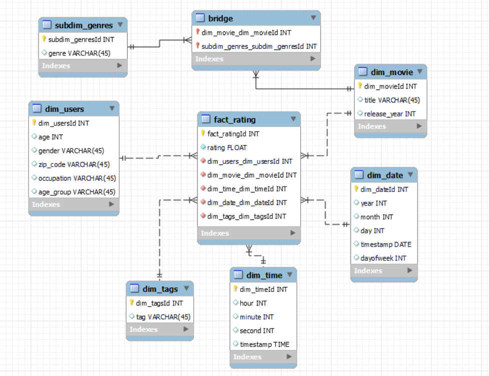

# **ETL proces datasetu MovieLens**

Tento repozitár obsahuje ETL proces implementovaný v Snowflake na spracovanie a analýzu dát z datasetu MovieLens. Analýza pokrýva filmy, žánre, hodnotenia a údaje o používateľoch, čím umožňuje multidimenzionálnu analýzu a vizualizáciu kľúčových metrik. Výsledný dátový model podporuje efektívne reportovanie a odhaľovanie trendov v preferenciách používateľov.

---
## **1. Úvod a popis zdrojových dát**

Cieľom semestrálneho projektu je preskúmať hodnotenia filmov a demografické údaje používateľov, aby sa získali poznatky o ich preferenciách a sledovali trendy vo filmovej obľúbenosti.

Zdrojové dáta pochádzajú z datasetu dostupného [tu](https://grouplens.org/datasets/movielens/). Dataset obsahuje osem hlavných tabuliek:
- `age_groups`
- `genres`
- `genres_movies`
- `movies`
- `occupations`
- `ratings`
- `tags`
- `users`

Účelom ETL procesu bolo tieto dáta pripraviť, transformovať a sprístupniť pre viacdimenzionálnu analýzu.

---
### **1.1 Dátová architektúra**

### **ERD diagram**
Surové dáta sú usporiadané v relačnom modeli, ktorý je znázornený na **entitno-relačnom diagrame (ERD)**:

<p align="center">
  
  <br>
  <em>Obrázok 1 Entitno-relačná schéma MovieLens</em>
</p>

---
## **2. Dimenzionálny model**

Navrhnutý bol **hviezdicový model (star schema)**, pre efektívnu analýzu kde centrálny bod predstavuje faktová tabuľka **`fact_ratings`** a dimenzie:
- **`dim_movies`**: Obsahuje informácie o filmoch (názov, rok vydania).
    - **`subdim_genres`**: Obsahuje žánre filmov filmoch (názov).
- **`dim_users`**: Obsahuje demografické údaje o používateľoch(vek, vekové kategórie, pohlavie, povolanie).
- **`dim_date`**: Zahrňuje informácie o dátumoch hodnotení (deň, mesiac, rok,).
- **`dim_time`**: Obsahuje podrobné časové údaje (hodina, minuta, sekunda).

Štruktúra hviezdicového modelu je znázornená na diagrame nižšie. Diagram ukazuje prepojenia medzi faktovou tabuľkou a dimenziami, čo zjednodušuje pochopenie a implementáciu modelu.

<p align="center">
  
  <br>
  <em>Obrázok 2 Schéma hviezdy pre MovieLens</em>
</p>

---
## **3. ETL proces v Snowflake**
ETL proces pozostával z troch hlavných fáz: `extrahovanie` (Extract), `transformácia` (Transform) a `načítanie` (Load). Tento proces bol implementovaný v Snowflake s cieľom pripraviť zdrojové dáta zo staging vrstvy do viacdimenzionálneho modelu vhodného na analýzu a vizualizáciu.

---
### **3.1 Extrahovanie dát (Extract)**
Dáta zo zdrojového datasetu (formát `.csv`) boli najprv nahraté do Snowflake prostredníctvom interného stage úložiska s názvom `boa_stage`. Stage v Snowflake slúži ako dočasné úložisko na import alebo export dát. Vytvorenie stage bolo zabezpečené príkazom:

#### Príklad kódu:
```sql
CREATE OR REPLACE STAGE boa_stage;
```
Vytvorili sa stage tabulky ako dočasné úložisko pre údaje počas ETL procesu. Pre každú tabuľku sa použil podobný príkaz:
#### Príklad kódu:
```sql
CREATE OR REPLACE TABLE movies_staging (
    id INT PRIMARY KEY,
    title VARCHAR(255),
    release_year CHAR(4)
);
```
Do stage boli nahrané súbory s informáciami o filmoch, používateľoch, hodnoteniach, profesiách a žánroch. Dátové súbory boli načítané do staging tabuliek prostredníctvom príkazu COPY INTO. Pre každú tabuľku sa použil obdobný príkaz:

```sql
COPY INTO movies_staging
FROM @boa_stage/movies.csv
FILE_FORMAT = (TYPE = 'CSV'  SKIP_HEADER = 1);
```

V prípade nekonzistentných záznamov bol použitý parameter `ON_ERROR = 'CONTINUE'`, ktorý zabezpečil pokračovanie procesu bez prerušenia pri chybách.

---
### **3.2 Transformácia dát (Transform)**

V tejto fáze boli údaje zo staging tabuliek spracované, transformované a doplnené o ďalšie informácie. Táto štruktúra umožňuje efektívnu analýzu dát. Každá tabuľka má špecifickú úlohu, pričom spolupracujú na optimalizácii výkonnosti dotazov a prehľadnosti dát.

#### **dim_users**
Táto tabuľka obsahuje informácie o používateľoch. Používajú sa údaje zo staging tabuľky users_stagin.
#### Príklad kódu dim_users:
```sql
CREATE OR REPLACE TABLE dim_users AS
SELECT
    users_staging.id AS dim_usersId,
    users_staging.age AS age,
    users_staging.gender AS gender,
    occupations_staging.name AS occupation,
    users_staging.zip_code AS zip_code,
    CASE
        WHEN users_staging.age < 18 THEN 'Under 18'
        WHEN users_staging.age BETWEEN 18 AND 24 THEN '18-24'
        WHEN users_staging.age BETWEEN 25 AND 34 THEN '25-34'
        WHEN users_staging.age BETWEEN 35 AND 44 THEN '35-44'
        WHEN users_staging.age BETWEEN 45 AND 54 THEN '45-54'
        WHEN users_staging.age >= 55 THEN '55+'
        ELSE 'Unknown'
    END AS age_group,
FROM users_staging
LEFT JOIN occupations_staging ON users_staging.occupation_id = occupations_staging.id
LEFT JOIN age_group_staging ON users_staging.age = age_group_staging.id;
```
#### **dim_movie**
Obsahuje základné údaje o filmoch.
#### Príklad kódu dim_movie:
```sql
CREATE OR REPLACE TABLE dim_movie AS
SELECT
    movies_staging.id AS dim_movieId,
    movies_staging.title,
    movies_staging.release_year
FROM movies_staging;
```
Faktová tabuľka `fact_ratings` zaznamenáva hodnotenia a prepojenia na všetky príslušné dimenzie.
```sql
CREATE OR REPLACE TABLE fact_rating AS
SELECT
    rating_staging.id AS fact_ratingId,
    rating_staging.rating AS rating,
    dim_users.dim_usersId,
    dim_movie.dim_movieId,
    dim_time.dim_timeId,
    dim_date.dim_dateId,
    dim_tags.dim_tagsId  AS dim_tagsId
FROM rating_staging
JOIN dim_users ON rating_staging.user_id = dim_users.dim_usersId
JOIN dim_movie ON rating_staging.movie_id = dim_movie.dim_movieId
JOIN dim_time ON CAST(rating_staging.rated_at AS TIME) = dim_time.timestamp
JOIN dim_date ON CAST(rating_staging.rated_at AS DATE) = dim_date.timestamp
LEFT JOIN tags_staging ON rating_staging.id = tags_staging.id
LEFT JOIN dim_tags ON tags_staging.id = dim_tags.dim_tagsId;
```

---
### **3.3 Načítanie dát (Load)**

Po úspešnom vytvorení dimenzií a faktovej tabuľky boli dáta nahraté do finálnej štruktúry. Na záver boli staging tabuľky odstránené, aby sa optimalizovalo využitie úložiska:
```sql
DROP TABLE IF EXISTS users_staging;
DROP TABLE IF EXISTS genres_movies_staging;
DROP TABLE IF EXISTS age_group_staging;
DROP TABLE IF EXISTS rating_staging;
DROP TABLE IF EXISTS tags_staging;
DROP TABLE IF EXISTS occupations_staging;
DROP TABLE IF EXISTS genres_staging;
DROP TABLE IF EXISTS movies_staging;
```

ETL proces v Snowflake umožnil transformáciu pôvodných údajov z formátu `.csv` do viacdimenzionálneho hviezdicového modelu. Tento proces zahŕňal čistenie, obohacovanie a reorganizáciu dát. Výsledný model poskytuje základ pre analýzu preferencií a správania používateľov, čím umožňuje vytváranie vizualizácií a reportov.

---
## **4 Vizualizácia dát**

Dashboard obsahuje `päť vizualizácií`, ktoré poskytujú prehľad o kľúčových metrikách a trendoch súvisiacich s filmami, používateľmi a hodnoteniami. Tieto vizualizácie odpovedajú na zásadné otázky a pomáhajú lepšie porozumieť správaniu používateľov a ich preferenciám.

<p align="center">
  
  <br>
  <em>Obrázok 3 Dashboard MovieLens datasetu</em>
</p>

---
### **Graf 1: Najviac hodnotené filmy (Top 10 filmov)**
Táto vizualizácia zobrazuje 10 filmov s najväčším počtom hodnotení. Umožňuje identifikovať najpopulárnejšie tituly medzi používateľmi. Tieto informácie môžu byť užitočné na odporúčanie kníh alebo marketingové kampane.

```sql
SELECT
    m.title,
    AVG(f.rating) AS avg_rating
FROM 
    FACT_RATING f
JOIN 
    dim_movie m ON f.dim_movieid = m.dim_movieid
GROUP BY 
    m.title
ORDER BY 
    avg_rating DESC
LIMIT 10;
```
---
### **Graf 2: Najobľúbenejšie žánre filmov podľa vekových kategórií**
Táto vizualizácia zobrazuje obľúbenosť rôznych žánrov filmov medzi používateľmi rozdelenými do vekových skupín. Cieľom je identifikovať, ktoré žánre sú preferované v rôznych vekových kategóriách, čo môže pomôcť v lepšom cielení obsahu a odporúčaní filmov.

```sql
SELECT 
    u.age_group AS age_group,
    g.genre AS genre,
    COUNT(f.fact_ratingId) AS total_ratings
FROM FACT_RATING f
JOIN dim_users u ON f.dim_usersId = u.dim_usersId
JOIN bridge b ON f.dim_movieId = b.dim_movie_dim_movieId
JOIN subdim_genres g ON b.subdim_genres_subdim_genresId = g.subdim_genresId
GROUP BY u.age_group, g.genre
ORDER BY total_ratings DESC;
```
---
### **Graf 3: Priemerné hodnotenie filmov podľa roku vydania**
Táto vizualizácia ukazuje, ako sa priemerné hodnotenie filmov líši podľa roku ich vydania. Cieľom je zistiť, či sú novšie filmy hodnotené lepšie ako staršie, alebo či existuje nejaký trend v hodnotení filmov v priebehu času.

```sql
SELECT 
    m.release_year AS release_year,
    AVG(f.rating) AS avg_rating
FROM FACT_RATING f
JOIN dim_movie m ON f.dim_movieId = m.dim_movieId
GROUP BY m.release_year
ORDER BY m.release_year;

```
---
### **Graf 4: Počet hodnotení podľa času dňa**
Táto vizualizácia ukazuje rozdelenie počtu hodnotení počas rôznych častí dňa (hodiny). Pomáha identifikovať, kedy sú používatelia najaktívnejší a kedy by mohli byť organizované špeciálne kampane alebo akcie.

```sql
SELECT 
    t.hour AS hour,
    COUNT(f.fact_ratingId) AS total_ratings
FROM FACT_RATING f
JOIN dim_time t ON f.dim_timeId = t.dim_timeId
GROUP BY t.hour
ORDER BY t.hour;

```
---
### **Graf 5: Najviac hodnotené filmy podľa pohlavia používateľov**
Táto analýza ukazuje, ktoré filmy sú najviac hodnotené mužmi a ženami. Pomáha pochopiť rozdiely v preferenciách medzi pohlaviami, čo môže byť užitočné pri personalizácii odporúčaní.

```sql
SELECT 
    m.title AS title,
    u.gender AS gender,
    COUNT(f.fact_ratingId) AS total_ratings
FROM FACT_RATING f
JOIN dim_movie m ON f.dim_movieId = m.dim_movieId
JOIN dim_users u ON f.dim_usersId = u.dim_usersId
GROUP BY m.title, u.gender
ORDER BY total_ratings DESC;

```

Dashboard ponúka komplexný prehľad o dátach a zodpovedá kľúčové otázky súvisiace s čitateľskými preferenciami a správaním používateľov. Vizualizácie uľahčujú interpretáciu dát a môžu slúžiť na zlepšenie odporúčacích systémov a marketingových stratégií.

---

**Autor:** Ľuboš Krátky
